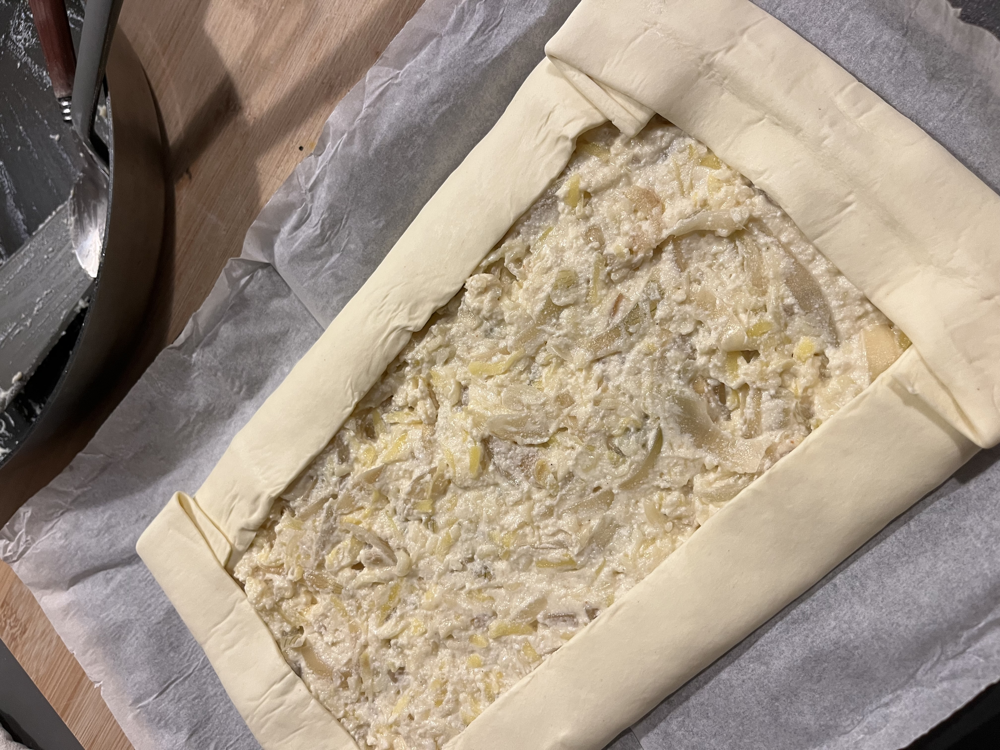

# Zwiebel-Käse-Quiche

#### Vegetarische Quiche für die Weihnachtsfeier der IZW am 3. Dezember 2024

### [English here!](https://github.com/diegomics/izw_xmas24/blob/main/ENG/README.md)

### [Español aquí!](https://github.com/diegomics/izw_xmas24/blob/main/ESP/README.md)
---
**Zutaten:**
- Zwiebeln
- Kartoffeln
- Ricotta
- Eier
- Geriebener Edamer-Käse
- Salz
- Weißer Pfeffer
- Muskatnuss
- Olivenöl
- Quiche-Teig (hausgemacht oder gekauft)

**Zubereitung:**

> Die in Streifen geschnittenen Zwiebeln in Olivenöl anbraten, bis sie leicht goldbraun sind.

 

> Vom Herd nehmen, die geriebenen Kartoffeln hinzufügen und vermischen.

 

> Ricotta einrühren und vermischen.

 

> Die Eier hinzufügen und erneut mischen.

 

>Den geriebenen Käse hinzufügen und gut vermengen.

 

>Mit Salz, Pfeffer und Muskatnuss nach Geschmack würzen. Die Mischung in eine mit Quiche-Teig ausgelegte Form geben. Im vorgeheizten Ofen bei mittlerer Hitze (ca. 180 °C) backen, bis die Oberfläche goldbraun ist.

 

*Voilà!*

 
